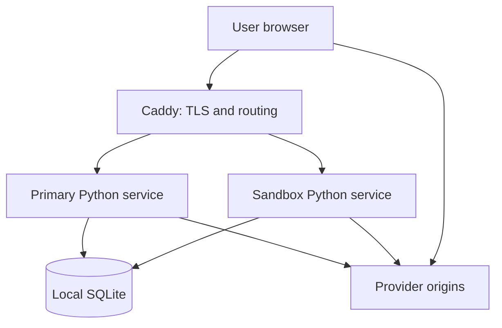

# Capacity, scalability, and resilience

This document records the current server-side capacity model for goster.me and
the architectural changes required to grow it safely. It describes the current
single-host deployment; it is not a claim that distributed infrastructure is
needed today.

Tracking: [Epic #41](https://github.com/humit/goster.me/issues/41).

Related boundary: [Epic #30](https://github.com/humit/goster.me/issues/30) owns
public-web performance, browser-visible provider cost, and web standards. This
document owns server-side saturation, vertical and horizontal scaling, and
availability. Provider-controlled browser transfer belongs to #30; outbound
provider fetch pressure on goster.me belongs to #41.

## Executive summary

The present architecture is efficient while most successful traffic resolves to
clean third-party embeds. goster.me serves a small first-party shell while the
browser downloads the heavy provider content directly. The first server-side
limits are therefore unlikely to be video bandwidth or media CPU.

The most likely bottlenecks, in order, are:

1. blocking provider HTML fetches occupying request threads;
2. local SQLite write serialization as viewer and analytics traffic grows;
3. per-process task, file-descriptor, CPU, and memory limits;
4. the process-local HTML cache, which has a time check but no global entry or
   byte bound;
5. repeated fetch and transform work on cold isolated-content opens;
6. the single VM and local disk as shared failure domains.

Vertical scaling is the correct first response while the service remains within
one node's recovery and write-concurrency envelope. Horizontal scaling is not a
matter of starting another Python process: durable state, rate limits, cache and
provider concurrency, sandbox authorization, maintenance ownership, deployment,
and observability must first become replica-safe.

## Current architecture and traffic ownership

Caddy, both Python services, SQLite, the repository checkout, configuration,
secrets, and systemd timers currently share one host. Provider origins and the
user browser are external.

### Request paths

| Path | Server work | Main capacity characteristic |
|---|---|---|
| Direct YouTube/embed resolve | Validate, classify, allocate short code, write analytics | Small CPU/network cost; SQLite writes dominate |
| Discovered embed resolve | Fetch and parse source HTML, then allocate short code | Provider latency holds one request thread |
| Embed viewer | Read/touch short link, write analytics, serve shell | Small transfer, but a logical read currently creates writes |
| Cold isolate viewer | Serve shell; sandbox fetches, transforms, and returns source HTML | Provider latency, HTML memory, CPU, and server ingress/egress |
| Warm isolate viewer | Same path with a possible process-local HTML cache hit | Lower origin ingress but still transform/response work |
| Unsupported target | Validate, attempt adapters, record bounded backlog and analytics | May perform several logical adapter attempts over one cached fetch |

The primary and sandbox services are separate processes, so their in-memory HTML
caches are not shared. A newly resolved isolated page can be fetched once by the
primary service during resolution and again by the sandbox during the first
viewer open.

The source HTML fetch is limited to 2 MiB and has a 15-second timeout. This
bounds one request, but it does not bound the number of simultaneous outbound
fetches or the aggregate cache size.

## Current resource envelope

The systemd settings are safety ceilings, not reservations and not measured
capacity.

| Resource | Primary service | Sandbox service |
|---|---:|---:|
| `MemoryHigh` | 192 MiB | 128 MiB |
| `MemoryMax` | 256 MiB | 192 MiB |
| `CPUQuota` | 100% | 75% |
| `TasksMax` | 64 | 32 |
| `LimitNOFILE` | 512 | 256 |

The application services can therefore reach a combined 448 MiB hard memory
ceiling and 175% CPU quota. Caddy, the kernel page cache, SQLite filesystem I/O,
system services, and the operating system are outside those totals.

The short-link store is configured for 50,000 rows, a 45,000-row trim target, a
256 KiB maximum serialized item, and a 128 MiB database cap. Analytics,
feedback, unsupported-target records, and short links currently share the same
SQLite file and therefore the same disk and write failure domain.

## Bottleneck analysis

### 1. Provider fetch concurrency and tail latency

Resolution and sandbox rendering perform synchronous outbound HTTP requests from
request-handler threads. A slow provider can occupy a thread for up to the
15-second timeout. The current per-client resolve rate limit limits one abuse
source, but there is no global or per-provider concurrency budget.

Likely failure progression:

1. provider response time increases;
2. active handler threads and outbound sockets accumulate;
3. `TasksMax` or file-descriptor headroom shrinks;
4. request latency rises even when local CPU remains low;
5. timeouts and 5xx responses appear.

Scaling CPU or RAM alone does not fix this path. The immediate control is bounded
concurrency with provider-specific bulkheads, explicit overload responses, and
measured timeout/circuit-breaker policy.

### 2. SQLite single-writer contention

The current data path is more write-heavy than the product surface suggests:

- short-code creation inserts a row;
- a normal viewer open updates `last_accessed_at` and `access_count`;
- the same open inserts an analytics event;
- unsupported targets, feedback, notification state, and maintenance use the
  same database file.

SQLite is a good fit for the present single-node volume, but concurrent writers
serialize. No explicit WAL policy is currently part of the application contract.
At higher concurrency, database lock wait and storage latency can become the
first local bottleneck even though most viewer responses are logically reads.

Before replacing SQLite, measure transaction latency and lock evidence, test WAL
and busy handling, and decide whether exact per-open touch counters are worth a
synchronous write. Moving to multiple application nodes requires a shared
transactional store; copying the SQLite file between active nodes is not a safe
horizontal scaling design.

### 3. Single-process HTTP and task limits

Both services use `ThreadingHTTPServer`. Each request receives a thread and
outbound provider work blocks that thread. Threads help with I/O concurrency, but
CPU-heavy Python parsing and transformation remain constrained by the GIL within
each process.

Increasing VM cores helps Caddy, the kernel, and the two independent Python
processes, but one busy primary or sandbox process cannot use arbitrary extra
cores for Python CPU work. A bounded multi-process production server model is the
vertical scaling ceiling after the HTTP layer has an explicit worker,
backpressure, graceful-shutdown, and readiness contract.

Starting extra processes before externalizing rate-limit state and defining
cache/provider concurrency semantics would multiply limits rather than enforce
them globally.

### 4. Process-local HTML cache growth

Fetched HTML is cached per process for 120 seconds. Expiry is checked when the
same URL is accessed again, but there is no periodic sweep, LRU entry ceiling, or
aggregate byte ceiling. Many unique URLs can therefore leave expired documents
resident until process restart or memory pressure terminates the service.

The encoded HTTP body is capped, but a decoded Python string and transformation
copies can occupy several times the network size. The primary and sandbox
processes can also hold separate copies of the same document.

This should be corrected before raising `MemoryMax`: use a cache with explicit
entry and byte budgets, true expiry eviction, hit/miss/eviction metrics, and no
security-policy bypass on a hit.

### 5. Isolate cold-path amplification

A cold isolate lifecycle can fetch the same source HTML during resolution and
again during sandbox rendering. The sandbox then returns transformed HTML through
goster.me while CSS, JavaScript, images, fonts, media, and most provider requests
normally travel directly from provider to browser.

This is not a full-content bandwidth bottleneck, but popular isolated pages can
create avoidable provider fetch pressure. A shared, strictly bounded short-lived
fetch result may remove duplicate work. Persisting transformed third-party HTML
or placing it in a CDN is a separate product, freshness, copyright, privacy, and
security decision and must not happen as an incidental cache optimization.

### 6. Smaller local hot paths

- QR SVGs are generated on request and could be cached if measurement shows
  meaningful CPU use.
- Stable static assets currently pass through the application/Caddy stack; a CDN
  can remove that work later, but these assets are too small to justify early
  infrastructure by themselves.
- Retention cleanup and feedback notification are local timers. Their current
  cost is small, but replica ownership becomes ambiguous after horizontal scale.
- Caddy compression consumes CPU, although Caddy is unlikely to be the first
  bottleneck at the current first-party payload size.

## Saturation signals

`tools/goster resource-status` is the first implementation item in #41. Initial
thresholds must be calibrated with production observations and controlled load
tests rather than treated as universal constants.

| Signal | What it indicates | Likely response |
|---|---|---|
| Resolve/sandbox p50, p95, p99 latency by provider | Provider or local fetch saturation | Provider bulkhead, timeout/circuit policy, then capacity |
| Active tasks versus `TasksMax` | Blocked request-thread pressure | Bound concurrency; do not only raise the ceiling |
| Open FDs versus `LimitNOFILE` | Socket/file pressure | Find leak or concurrency cause before raising limit |
| CPU versus quota with latency | Local parse/transform/compression saturation | Profile, then quota/worker/VM change |
| Current/peak memory versus `MemoryHigh`/`MemoryMax` | Cache or concurrent-document pressure | Bound cache/concurrency before adding RAM |
| HTML cache entries/bytes/hit/eviction | Cache effectiveness and safety | Adjust bounded policy using observed working set |
| SQLite write latency and busy/locked events | Single-writer/storage contention | Reduce writes, test WAL, then external DB |
| Database bytes, rows, freelist, disk/inodes | Retention or storage pressure | Maintenance, storage alert, capacity change |
| Provider fetch bytes and cache-hit ratio | Server-side traffic ownership | Remove duplicate fetches or tune bounded cache |
| 429/502/503 and timeout rates | Admission control or dependency failure | Distinguish overload from provider outage |
| Maintenance/backup last-success age | Recovery-data staleness | Repair timer/backup before scaling traffic |

The resource-status command must remain read-only and safe for operator output.
It must never print source URLs, feedback, visitor tags, secrets, environment
values, signed sandbox queries, or other bearer material.

### Minimum `resource-status` contract

- timestamp, production SHA, and service state;
- current and peak CPU/memory/task/FD observations plus configured limits;
- SQLite logical size, safe aggregate row counts, freelist, and filesystem
  headroom;
- recent bounded counts of OOM, restart, database-busy, timeout, and HTTP failure
  evidence where available;
- explicit `unavailable` output for metrics that have not yet been instrumented;
- a non-zero exit only when collection itself fails or an explicit critical
  health contract is violated.

## Vertical scaling

Vertical scaling should be used while one node still meets the required recovery
objective and SQLite remains below its contention envelope.

### Safe vertical sequence

1. Measure representative cold/warm embed and isolate paths.
2. Bound cache size and outbound concurrency.
3. Remove unnecessary synchronous viewer writes.
4. Verify backup/restore and local storage latency.
5. Add RAM only for a measured working set and concurrent-request requirement.
6. Add CPU and adjust quotas only after profiling shows local CPU saturation.
7. Introduce bounded worker processes when one Python process is the measured
   limit.
8. Repeat load, failure, and rollback tests after every resource-policy change.

### Vertical ceiling

A larger VM does not remove:

- the VM, disk, and Caddy failure domain;
- SQLite single-writer serialization;
- process-local rate-limit and cache semantics;
- one-process GIL limits;
- timer singleton and deployment ownership;
- dependency on provider availability.

Reaching any of those limits is a reason for a targeted architecture change, not
automatically a reason for a still larger VM.

## Horizontal scaling prerequisites

| Concern | Current model | Replica-safe model |
|---|---|---|
| HTTP entry | One Caddy and one service process per role | Health-checked load balancer and independent primary/sandbox pools |
| Short links and mutable state | Local SQLite | Shared transactional database with tested migrations and backups |
| Viewer touch/analytics writes | Synchronous local writes | Reduced/aggregated writes or scalable event ingestion |
| Rate limiting | In-memory per process | Shared limiter or edge enforcement with a documented trust model |
| HTML cache | Process-local and unbounded | Bounded per-node cache; optional bounded shared cache when justified |
| Provider concurrency | Implicitly bounded by one process | Global and per-provider budgets across replicas |
| Sandbox item lookup | Read-only local SQLite | Least-privilege shared/read-replica access or another authoritative contract |
| Sandbox capability | Shared HMAC key | Replicated secret with rotation and overlap policy |
| Maintenance/timers | Local systemd timers | Elected singleton, managed scheduler, or idempotent distributed job |
| Deployment | Mutable checkout and service restart | Immutable artifact, rolling deployment, readiness, schema compatibility |
| Configuration/secrets | Local environment file | Versioned non-secret config and managed replicated secrets |
| Observability | Local status/log inspection | Central metrics/logs with capability-query redaction |

The primary and sandbox pools must remain separate security and scaling domains.
The sandbox should retain read-only access to the minimum item state it needs;
horizontal scaling must not weaken the dedicated-origin boundary or create a
parallel unrestricted fetch path.

### Recommended progression

#### Phase 0 — measure and bound the current node

- implement `tools/goster resource-status`;
- add route/render-mode and provider fetch latency/byte metrics;
- bound HTML cache and outbound provider concurrency;
- establish capacity tests and saturation behavior;
- automate backup and complete a restore drill;
- monitor timer, disk, certificate, and database health.

#### Phase 1 — strengthen the single node

- right-size VM, filesystem, and systemd limits from evidence;
- reduce avoidable SQLite writes and test WAL/busy behavior;
- introduce a bounded production worker model if the single process is limiting;
- add provider circuit breakers and an emergency adapter/provider kill switch.

#### Phase 2 — active/passive recovery

- define RPO and RTO;
- make state, configuration, secrets, and artifacts recoverable on a second node;
- rehearse node loss and DNS/load-balancer cutover;
- prefer this simpler recovery step before active/active complexity when traffic
  does not require simultaneous nodes.

#### Phase 3 — active/active horizontal scale

- move durable state to a shared transactional service;
- externalize shared limits and coordination;
- run multiple primary and sandbox replicas behind health-checked pools;
- use rolling, backward-compatible schema and application deployment;
- validate aggregate provider concurrency and overload behavior.

#### Phase 4 — regional resilience

Consider multi-region state and routing only after measured availability or
latency requirements justify the consistency, failover, cost, and operational
complexity. It is not a near-term default.

## Single points of failure

| Failure domain | Current impact | Mitigation order |
|---|---|---|
| VM, host network, or power | All public and sandbox traffic stops | Monitoring and restore drill; active/passive node; later multi-node pools |
| Local disk or SQLite file | Short links and product state unavailable or lost | Encrypted backup, restore test, disk alert; later shared HA database |
| Caddy or public listener | Both origins unavailable | Config validation/backup, restart/readiness; later redundant entry layer |
| Primary Python process | Landing, resolve, viewer shell, feedback unavailable | systemd restart, readiness, bounded workers/replicas |
| Sandbox Python process | Isolated activities unavailable; embeds may remain usable | Separate readiness and pool; graceful mode-specific failure |
| Sandbox signing key/env file | Isolate unavailable; compromise can mint capabilities | Protected replicated secret, rotation/overlap and revocation procedure |
| DNS/TLS control plane | Clients cannot reach otherwise healthy services | Account protection, expiry monitoring, documented recovery, redundant edge later |
| Deployment checkout/workflow | Bad or ambiguous deployment affects the only node | Exact-SHA staging, known-good rollback, immutable artifacts later |
| Local timers | Retention, backup, or feedback notification silently stops | Last-success monitoring; elected/idempotent job after replicas |
| Provider origin/domain | One provider class resolves or renders poorly | Per-provider health, circuit breaker, kill switch, clear degraded response |
| Operator access path | Recovery may be delayed | Documented break-glass access and tested runbooks |

Provider origins are unavoidable external dependencies, not infrastructure that
goster.me can make highly available. Resilience means containing their failure,
attributing it correctly, and preserving the rest of the product.

## Capacity test matrix

Every baseline should record request rate, concurrency, success/error count,
latency percentiles, CPU, memory peak, task/FD peak, SQLite write latency,
provider bytes/latency, and cache behavior.

| Scenario | Required variants |
|---|---|
| Landing and stable pages | cold/warm static assets; sustained read load |
| Direct embed resolve | new short-code writes; supported and malformed input |
| Discovered embed resolve | fast, slow, timeout, redirect rejection, oversized HTML |
| Embed viewer | hot code; analytics enabled; copy/share events separate |
| Isolate viewer | cold cache, warm cache, slow provider, concurrent same URL, concurrent unique URLs |
| Unsupported target | known host/not applicable and unknown host |
| Storage pressure | database near row/byte cap; maintenance concurrent with reads/writes |
| Failure recovery | main restart, sandbox restart, provider outage, disk read-only/full simulation, restore |

Load tests must use temporary state and controlled fixtures where possible. Tests
against real providers must use conservative concurrency so capacity work does
not become abusive traffic.

## Scaling decision rules

- Do not scale from request counts alone; scale from resource saturation,
  latency/error SLOs, recovery requirements, and measured provider pressure.
- Bound work before adding capacity. Raising task, FD, or memory limits without
  fixing unbounded admission/cache behavior increases blast radius.
- Do not add a second active primary writer while durable state remains local
  SQLite.
- Do not add replicas while rate limits and provider concurrency silently
  multiply per process.
- Prefer active/passive recovery before active/active when availability, not
  throughput, is the requirement.
- Keep embeds direct-to-provider; do not convert goster.me into a media proxy as
  a scaling shortcut.
- Preserve fail-closed adapters, centralized URL/redirect validation, and the
  dedicated sandbox origin through every topology change.

## Open decisions

The following choices intentionally remain measurement-driven:

- target service SLOs and RPO/RTO;
- the first alert thresholds after a production baseline exists;
- whether SQLite WAL and reduced touch writes provide enough headroom;
- the worker/process model after `ThreadingHTTPServer`;
- whether a shared short-lived fetch cache is worth its security and freshness
  complexity;
- PostgreSQL/managed relational service selection if active replicas are needed;
- Redis or edge-based coordination for global limits;
- active/passive versus active/active timing.

These decisions should be recorded in #41 as evidence becomes available rather
than embedded as premature infrastructure commitments.
